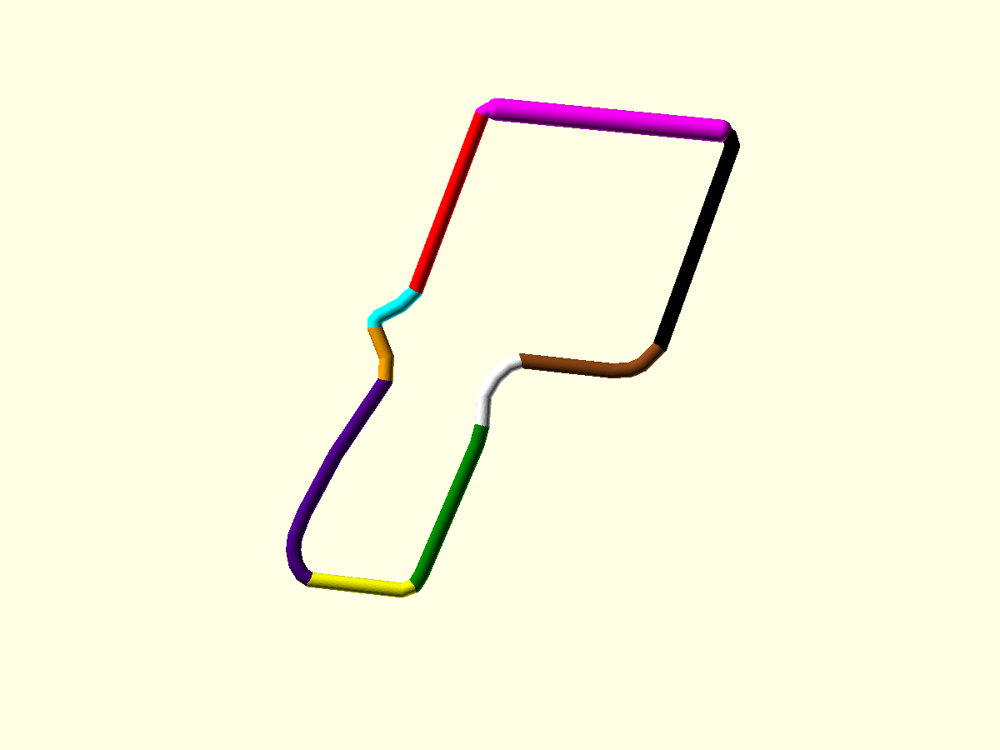

# Train Controller (slot-car hand controller)

We are designing a more ergonomic hand controller for working with minature railway locomotives.  This is an improvement
over the [4QD RBT Hand Control](https://www.4qd.co.uk/product/hand-control-box/).

# Enclosure Design (3D Print) and Assembly
## Files

| File                            | Purpose                                                              | Status                |
|---------------------------------|----------------------------------------------------------------------|-----------------------|
| `design.scad`                   | **Current working model.** Self-contained (no external files).       | Active — work here    |
| `profiles/body_outline.dxf`     | Ergonomic outline projected from `Left.stl`. Used by `design2.scad`. | Input for v2          |
| `ref/Left.stl`, `ref/Right.stl` | Example printed controller shells (ground-truth ergonomic shape).    | Reference             |
| `ref/controller3.jpg`           | Photo of the reference controller.                                   | Reference             |
| `renders/`                      | Rendered preview PNGs.                                               | Build output          |

Recommended: continue in **`design.scad`** — it is a single self-contained file.

## Coordinate convention

- **X** = up/down along the controller length. Top at **−X**, grip / butt at **+X**.
- **Z** = forward / backward.  Front at **+Z**, rear at **−Z**
- **Y** = thickness. The two shell halves separate along **Y**; the profile is centred on Y = 0.

## Face identification

The controller outline has **10 named faces**, each identified by a colour in the
diagram below. This terminology is used throughout the documentation and code.



| Face | Colour      | Points | Description                                              |
|------|-------------|--------|----------------------------------------------------------|
| 1    | Red         | 0→1    | **Rear Face** — back of the controller body              |
| 2    | Cyan        | 1→5    | **Tang Top** — upper surface of the tang                 |
| 3    | Orange      | 5→7    | **Tang Bottom** — lower surface of the tang              |
| 4    | Indigo      | 7→14   | **Grip Rear** — back of the pistol grip                  |
| 5    | Yellow      | 14→16  | **Grip Butt** — bottom/base of the grip                  |
| 6    | Green       | 16→19  | **Grip Front** — front of the pistol grip                |
| 7    | White       | 19→23  | **Trigger Throat** — opening where the trigger exits     |
| 8    | Brown       | 23→27  | **Underbelly** — underside of the controller body        |
| 9    | Black       | 27→30  | **Front Face** — front of the controller body            |
| 10   | Magenta     | 30→0   | **Instrument Panel** — raised surface for switches/meter |

The **Instrument Panel** (magenta) is pushed outward by `button_clearance = 20 mm`
along its face normal to provide room for internal components. The adjacent corner
fillets (points 28–29 and 31–33, 0) move with it to blend smoothly into the body.

## What the model produces

`design.scad` produces a complete, print-ready **hollow two-part shell** with
trigger, internal pot mount, control panel and connector:

1. **Ergonomic outline** — the real pistol-grip silhouette, embedded as an inline
   `polygon()` (`outline_points` / `outline_paths`), simplified from `Left.stl`.
2. **Slot removed** — the original finger slot has been deleted from the outline
   (its path is no longer referenced). Its location is preserved as data (see below).
3. **Thickness taper (Y)** — `head_thick = 60 mm` at the head, tapering to
   `grip_thick = 25 mm` at the grip, via `thickness_mask()`.
4. **Raised Instrument Panel** — the angled ~50° face (the switch/meter-mounting
   surface, outline edge 30→31) is pushed outward along its own normal by
   `button_clearance = 20 mm`, with its corner fillets travelling with it so it
   blends smoothly into the body.
5. **Rounded edges** — the whole body is softened via `minkowski()` with a
   sphere of radius `grip_round = 3 mm`, so the edges the hand wraps are
   comfortable. Set `grip_round = 0` to disable (see speed note below).
6. **Hollow shell** — the body is hollowed to a uniform `wall = 1.5 mm` shell
   (`inner_cavity()` = the outer surface shrunk inward by `wall`;
   `body_hollow()` = `body_solid()` minus that cavity). Verified 1.5 mm walls.
7. **Split into two halves** — `left_shell()` / `right_shell()` clip the hollow
   body at the Y = 0 plane into two mating halves.
8. **Mate features** — six perimeter M3 bolt bosses (through-bolt + hex nut
   trap) with alignment spigots
9. **Linear pot mount** — a solid box platform in the LEFT half holding a Bourns
   PTA2043 (35.5×9.5×6.5 mm) along the recorded diagonal pot axis. The pot sits
   on top of the mounting box (30×15×18 mm) with 4 blind holes for the fixing
   pins (1.6 mm diameter, 4 mm deep), positioned per the datasheet (22.8 mm and
   25.2 mm centre-to-centre spacing). Two side clips grip the pot's top edges to
   prevent lifting. Ends are open for wire soldering access.
10. **Trigger + pivot + return spring** — a trigger lever (`trigger_lever()`)
    pivoting at `pivot_pos`: a BENT finger blade exiting the throat up-and-forward
    at ~45°, then curling back to a finger tip near `[0, 30]`, and an actuator arm
    with an elongated fork slot driving the pot lever.
    The pivot pin and spring anchor share a 3 mm rod (`rod_dia`), each captured
    in blind-bore bosses. A return spring hooks a hole in the armature and a
    rod in a body anchor boss, pulling the trigger to rest.
11. **Instrument panel** — holes drilled into the **Instrument Panel** along its normal
    via a face frame built from the face's four corners (`panel_face_place`). The
    LEFT half has four 6 mm toggle holes (master on its own row; horn / reverse /
    lights in a row at 15 mm pitch); the RIGHT half has the LED battery-meter
    cutout (square 25.5 × 2.2 mm slot + two 3.5 mm end holes, 33 mm apart). All
    clear of the bolt bosses.
12. **Thumb button** — a 6 mm push-button hole (`thumb_button_cut()`) on the
    **tang top** at `thumb_pos`, drilled along the local surface normal
    (`thumb_normal`). It sits ON the Y = 0 split, so it is halved into a matching
    semicircle in each shell.
13. **DX16 connector** — a panel-mount aviation socket (16 mm hole, 7 mm thread,
    inner retaining nut) on the **Grip Butt** at `cable_pos`, drilled
    along the local surface normal. Because a threaded connector needs a flat
    full-thickness seat (not a split semicircle), it uses a moulded round **pad**
    (`connector_pad()`, Ø19, 2 mm proud + 3 mm in) on the LEFT shell that crosses
    the seam so the hole stays centred; the RIGHT shell has a matching recess
    (`connector_recess()`). An internal **reinforcing collar**
    (`connector_reinforce()`, LEFT half only) thickens the wall around the socket
    for strength. The Ø16 bore (`connector_hole()`) cuts through both halves.

### Key parameters (top of `design.scad`)

- `grip_thick`, `head_thick` — body thickness (Y) at grip / head.
- `taper_head_x`, `taper_grip_x` — where the thickness taper starts/ends along X.
- `button_clearance` — how far the Instrument Panel is pushed out (room above the pot).
- `button_face_normal`, `button_move_idx` — direction and which outline points move
  (the Instrument Panel + both corner fillets: `[28,29,30,31,32,33,0]`).
- `grip_round` — edge-rounding radius (mm); `0` disables it.
- `wall` — shell wall thickness (mm).
- `screw_boss_pos` — list of `[X, Z]` boss/bolt locations (currently six).
- `screw_clear_dia`, `screw_boss_dia` — bolt clearance hole / boss diameter.
- `screw_head_dia`, `screw_head_depth` — round bolt-head recess (left face).
- `nut_af`, `nut_depth` — hex nut recess across-flats / depth (right face).
- `spigot_dia`, `spigot_len`, `spigot_clear` — boss alignment spigot / fit.
- `pot_len`, `pot_wid`, `pot_hgt` — PTA2043 body envelope (35.5 / 9.5 / 6.5 mm).
- `pot_box_len`, `pot_box_wid`, `pot_box_hgt` — mounting box platform dimensions (30 / 15 / 18 mm).
- `pot_pin_hole_dia`, `pot_pin_hole_depth` — blind hole for fixing pins (1.6 mm dia, 4 mm deep).
- `pot_clip_thick`, `pot_clip_overlap` — side clip dimensions (1.5 mm thick, 1.5 mm overlap).
- `pot_inset` — how far the pot top sits below the split (armature clearance).
- `pot_shift` — shift along the pot long axis (+ve = toward the back/grip).
- `pot_lever_slot_w` — lever clearance slot width (6.5 mm, matches pot lever).
- `rod_dia` — shared metal-rod diameter for BOTH the trigger pivot pin and the
  spring anchor rod (default 3 mm, a common steel dowel / silver-steel size).
- `trigger_thick`, `trigger_hub_dia` — trigger lever thickness / pivot hub.
- `trigger_blade_len`, `trigger_blade_ang` — first blade segment reach/angle out
  of the throat.
- `trigger_blade_knee`, `trigger_blade_tip2` — the bend: knee (near the pivot,
  end of the first segment) and the curled finger tip `[X,Z]` (default `[0,30]`).
- `trigger_arm_aim`, `trigger_arm_extra`, `trigger_arm_w` — actuator arm target,
  extra length, width.
- `trigger_fork_slot`, `trigger_fork_len`, `trigger_fork_pivot_ext` — elongated
  fork slot (width / length / extension toward the pivot) that drives the pot lever.
- `trigger_throat_ext`, `trigger_throat_lowext` — throat cutout swing clearance.
- `pivot_boss_dia`, `pivot_hub_gap`, `pivot_bore_depth` — pivot boss / blind bore.
- `spring_trigger_pos`, `spring_hole_dia` — spring hook hole in the armature.
- `spring_anchor_pos`, `spring_boss_dia`, `spring_bore_depth` — body spring-anchor
  boss + blind bore for the captured rod.
- `ip_TL`, `ip_TR`, `ip_BL`, `ip_BR` — the four corners of the Instrument Panel
  (ground-truth coordinates); the `panel_face_place(u,v)` frame is built from them.
- `toggle_hole_dia`, `panel_drill` — toggle hole diameter / drill depth.
- `toggle_master_u`, `toggle_master_v` — master switch position (upper row).
- `toggle_row_u`, `toggle_row_v` — horn / reverse / lights positions (lower row).
- `meter_slot_l`, `meter_slot_w`, `meter_end_holes`, `meter_hole_span`,
  `meter_u`, `meter_v_right` — LED battery-meter slot + end-hole geometry / placement.
- `thumb_pos`, `thumb_dia`, `thumb_normal`, `thumb_drill` — thumb-button hole
  centre `[X,Z]`, diameter (6 mm), local surface normal, and drill depth. The
  hole is centred on Y = 0 so it splits into a semicircle per shell.
- `cable_pos`, `cable_normal` — DX16 connector centre `[X,Z]` on the grip butt
  and its local outward surface normal (the drilling / socket axis).
- `conn_hole_dia`, `conn_pad_dia`, `conn_pad_proud`, `conn_pad_y` — DX16 bore
  (16 mm), pad diameter (19 mm), pad proud height, and total pad length.
- `conn_reinf_dia`, `conn_reinf_len` — internal reinforcing collar diameter /
  inward depth (LEFT half only). `conn_recess_clear` — right-shell recess fit.
- `part_to_render` — `left_shell`, `right_shell`, `trigger`, `export_stl`,
  `partial_exploded_assembly`, `closed_assembly`, `exploded_assembly`.

## How to render

From the project root (paths in the file are relative):

```bash
# quick preview (isometric)
openscad -o renders/iso.png --camera=200,-260,150,-5,0,5 --viewall design.scad

# clean orthographic side view (the ergonomic silhouette)
openscad -o renders/side.png --camera=0,300,0,0,0,0 --viewall --projection=o design.scad

# export the print-ready plate (all three parts, print orientation)
openscad -o stl/export_plate.stl --render -D 'part_to_render="export_stl"' design.scad
```

Tip: `--viewall` frames the model automatically; `--projection=o` gives a true
orthographic view (best for judging profiles).

## Assembly & fasteners

- **Bolts:** six M3 through-bolts (`screw_boss_pos`). Each drops into a round
  head recess on the LEFT outer face, through a 3.4 mm clearance hole, into a
  hex **nut trap** (`nut_af = 5.5 mm` A/F) on the RIGHT face. Right-half
  **spigots** register into left-half counterbores for alignment.
- **Rods:** the trigger pivot pin and the spring anchor share one `rod_dia`
  (3 mm) steel rod, each captured in blind-bore bosses.
- **Print plate:** `part_to_render = "export_stl"` lays all three parts on the
  bed in print orientation (left shell −90°, right shell / trigger +90° about X),
  each on `Z = 0` and spaced along Y. Each part is manifold (`Simple: yes`).
  The `left_shell` / `right_shell` / `trigger` modes export a single part in its
  native orientation.

## Notes

- The inline outline is a simplified version of the DXF (49 points via
  Douglas-Peucker, ~0.3 mm tolerance). Regenerate with a tighter tolerance if a
  closer match to the original mesh is ever needed.
- The pot axis is diagonal (~−51°); the slide pot mounts at that angle.
- Edge rounding uses `minkowski()`, which needs a full CGAL render
  (`openscad --render ...`) and is slow (~15–30 s). For fast iteration while
  working on other features, set `grip_round = 0`, then restore it for final
  renders / export.

## TODO

### ~~1. Identify the faces~~ ✓ DONE
See [Face identification](#face-identification) section above.

### ~~2. Narrower gap for the trigger lever~~ ✓ DONE
- The trigger lever is 6mm thick (`trigger_thick`), with 0.5mm clearance per side
- Total slot width = 7mm (set by `pivot_hub_gap = trigger_thick/2 + 0.5`)

### ~~3. Refine the pot mounting~~ ✓ DONE
- ✓ Updated pot dimensions to PTA2043: 35.5mm × 9.5mm × 6.5mm
- ✓ Created solid box platform (30mm × 15mm × 18mm) with 4 blind holes for fixing pins
- ✓ Pin holes are 1.6mm diameter (tight fit for 1.5mm pins), 4mm deep
- ✓ Pin spacing: 22.8mm left side, 25.2mm right side (per datasheet)
- ✓ Added 4 clips (3mm wide each) to grip the pot top and prevent lifting
- ✓ Ends remain open for wire soldering access
- ✓ Pot moved 6mm closer to front (black) face (`pot_shift` changed to -1)
- ✓ Trigger pivot moved to align with pot position
- ✓ Trigger blade straightened with bend at [-10, 10], tip at [0, 25]
- ✓ Throat cutout extended 5mm toward black face

### 3. move the hub for the trigger spring
- The hub for the trigger spring should move in line with the end of the pot
- The hub should be touching the rear (red) face

### 4. Horn buttons
- There will now be 2 horn buttons
- One will be mounted in each side of the controller
- See the BOM for the hole size required
- The horn buttons will now be mounted in the rear (red) face, close to the tang top (cyan) face

### 5. power switch
- The power switch will now be a slide switch not a toggle
- See the BOM for panel cut-out requirements
- The switch will remain on its own on the left side

### 6. lights / reverse switch
- We no longer need a horn select switch, so there are only two toggle switches on the top panel
- These should occupy the top and bottom holes, with the middle hole filled in
- Note the new hole size in the BOM, and the need for secondary holes for the locking washer

### ~~7. Shorten trigger slightly~~ ✓ DONE
- ✓ Trigger blade shortened by 5mm (from 25mm to 20mm)

### 8. Trigger slot.
- The slot in the trigger is not wide enough for the lever on the pot
- Make the slot 6.5mm wide

### 9. Grip size
- The grip is too short to be held comfortably in adult hand.
- The grip needs to be around 25mm longer, extended toward the butt (yellow) face

### 10. socket mounting
- the 15mm ring for the aviation socket is too wide to work.
- The socket will now be mounted centrally in a 25mm x 25mm square of sheet metal
- The metal will be 1mm thick
- create a square hole with slots for this metal square to slide into
- you will need to flare the bottom of the butt out slightly in the y-axis to accommodate this

### 11. cable tidy
- we will need to keep wires away from the moving trigger lever
- wires will run as along the inside of the handset, along the surfaces with the highest (and lowest) y values
- please place some eyes to which cable ties can be attached in judicious places
- feel free to suggest other cable management solutions that might work better

### 12. button caps
- the 2 horn buttons have very small, hard-plastic cylinders to push, and these dig into the user's thumb
- can we design a simple button cap that can be affixed to the buttons after they have been mounted in the controller

### 13. discuss joining the 2 halves
- the joint we have between the 2 halves gives some flex around the joint, particularly on front (black) face
- discuss ways to improve the joint

# Circuit Design and Parts

## Circuit References
https://www.4qd.co.uk/docs/din-socket-wiring/
https://www.4qd.co.uk/docs/rbt-plug-alignment/
https://www.4qd.co.uk/docs/rbt-circuit-diagram/

## BOM
### DPST main on/off switch
- DPDT 2-Position On-On Mini Slide Switch
- https://www.bitsboxuk.com/index.php?main_page=product_info&products_id=869
- 2x 2.5mm fixing holes 19mm centre-to-centre
- 4.5mm x 10mm slot central longways between fixing holes 

### SPST lights switch
- multicomp 1MS2T6B11M1QE Flat Toggle Switch, SPDT
- https://cpc.farnell.com/multicomp-pro/1ms1t6b11m1qe/switch-spdt/dp/SW02863
- can substitute Round Toggle Switch, SPST
- https://www.bitsboxuk.com/index.php?main_page=product_info&products_id=872
- 6.5mm mounting hole, with a 2.5mm hole placed 6.5mm above it (centre-to-centre) for the locking lug

### SPST reverse switch
- same as lights switch

### Momentary Horn Buttons
We use two SPDT momentary push buttons in a mechanical interlock.
- multicomp 8MS8P1B05M1QES (has a 2.5mm diameter button)
- https://cpc.farnell.com/multicomp-pro/mc8ms8p1b05m1qes/switch-spdt-on-mom-solder/dp/SW05800
- 5mm mounting hole

### Slide potentiometer for accelerator
- Bourns PTA Range - PTA2043-2010CIB103
- 10k linear single gang slide pot
- https://www.bitsboxuk.com/index.php?main_page=product_info&products_id=3247
- https://www.bourns.com/docs/Product-Datasheets/pta.pdf
- 35.5mm long x 9.5mm wide x 6.5mm deep
- slide has a 20mm range
- slide lever is 10mm tall x 5mm wide x 1.75mm thick
- 4x 1.5mm wide, 3mm tall fixing pins on the underside, a pair on each side
- fixing pins are centre-to-centre 22.8mm apart on the left side, 25.2mm apart on the right side
- wires attach to 0.8mm pins at both ends on the underside, so these must be accessible 

### Diodes
- 1N4001 Rectifier Diode 1A 50V
- https://www.bitsboxuk.com/index.php?main_page=product_info&products_id=1888

### Battery meter (BCM)
- Simple voltage divider – c/f
- https://www.4qd.co.uk/product/battery-condition-meter/
- 2x 3.5mm fixing holes 33mm centre-to-centre
- 25.5mm x 2.2mm slot central longways between fixing holes

### 8-core cable
- 7 x 0.2mm multicore cable
- https://cpc.farnell.com/pro-elec/pelb0640/cable-7-2-8a-unshielded-black/dp/CB22630
- https://www.4qd.co.uk/product/control-cable-multicore/
- https://www.amazon.co.uk/gp/product/B005EHZ6UI
- https://www.bitsboxuk.com/index.php?main_page=product_info&products_id=1496

### 8-pin aviation connectors (GX16)
- https://cpc.farnell.com/pro-signal/av19318/multipole-panel-plug-8p/dp/AV19318
- https://cpc.farnell.com/pro-signal/av19305/multipole-socket-8-pole/dp/AV19305
- https://www.amazon.co.uk/gp/product/B07VNKZB65
- https://www.aliexpress.com/item/1005006731992794.html
- 15mm Cutout diameter

### Pins
- https://www.amazon.co.uk/dp/B0DBYCCZ2J

### Spring
- https://cpc.farnell.com/duratool/d01893/spring-set-200pc/dp/FN02651

### bolts
- https://www.amazon.co.uk/dp/B0DGSY35WC
- https://www.amazon.co.uk/dp/B0D8SG7R6F
